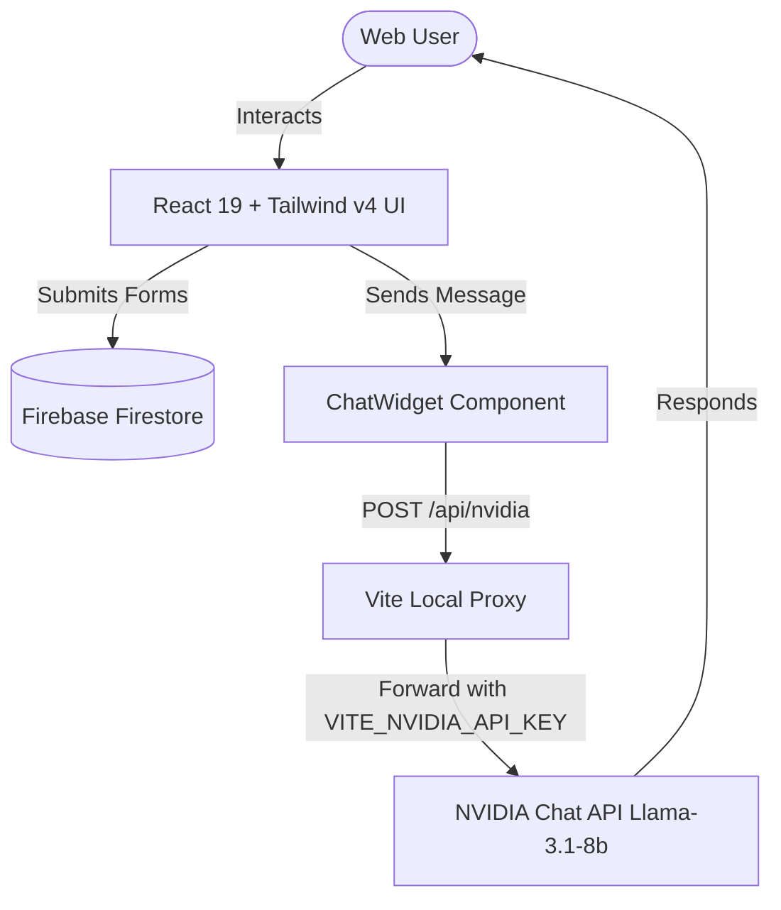

# ⚡ EngageFlow | Turbo Tech Solutions

**EngageFlow** is a premium, high-conversion enterprise conversation & chatbot automation platform. This repository houses the high-fidelity React 19 + Vite web application representing the platform's public portal, marketing hub, and user sandbox interface.

---

## 🚀 Key Features

* **32+ High-Fidelity Pages**: Specialized marketing hubs, Academy courses, whitepaper resources, and developer API references.
* **AI Agent Chatbot**: Floating conversational assistant powered by the NVIDIA Llama-3.1 model.
* **Official Meta WhatsApp API Integration**: Campaigns, catalog synchronization, and sandbox testing flows.
* **Premium UX/UI**: Beautiful glassmorphic panels, rich dark-mode gradients, and smooth kinetic scrolling via Lenis + Framer Motion.

---

## 🛠️ Technical Stack & Architecture

* **Frontend**: React 19, Vite, Tailwind CSS v4, Zustand (state), TanStack React Query v5 (caching).
* **Animations & Motion**: Lenis (kinetic physics scrolling), Framer Motion (micro-animations, accordion transitions).
* **Database & Auth**: Firebase Firestore (stores contact submissions and demo requests).

### 🔌 System Mechanics & Integrations



#### A. NVIDIA AI Chat Proxy (in `vite.config.js`)
To securely authenticate requests and bypass CORS policies, all NVIDIA cloud LLM requests route through Vite's local proxy:
```javascript
proxy: {
  '/api/nvidia': {
    target: 'https://integrate.api.nvidia.com/v1/chat/completions',
    changeOrigin: true,
    rewrite: (path) => path.replace(/^\/api\/nvidia/, ''),
  }
}
```

#### B. Firebase Firestore Setup (in `src/firebase.js`)
All contact and demo registrations are securely stored in the following Firestore collections:
* `contact_submissions`
* `demo_requests`

---

## 📂 Directory Structure

```text
Tech_Turbo_Solution_Web/
├── public/                 # Static assets (images, logos)
├── src/
│   ├── api/                # Mock and Live API hooks
│   ├── assets/             # Raw styles, media, and images
│   ├── components/         # Reusable layouts (Navbar, Footer, ChatWidget)
│   ├── pages/              # 32+ high-fidelity pages & solutions subpages
│   ├── services/           # External service configurations
│   ├── store/              # Zustand global state (uiStore.js)
│   ├── App.css             # Main styling rules
│   ├── App.jsx             # React Router routing config
│   ├── firebase.js         # Firebase App initialization
│   ├── index.css           # Custom CSS utilities & Tailwind directives
│   └── main.jsx            # Application entrypoint
├── .env                    # Environment credentials
├── vite.config.js          # Vite and Server Proxy configurations
└── package.json            # Dependencies list
```

---

## 💻 Local Development Setup

### 1. Prerequisites
Ensure you have [Node.js](https://nodejs.org/) (v18 or higher) installed.

### 2. Installation
```bash
npm install
```

### 3. Environment Configuration
Create a `.env` file in the root directory:
```env
# NVIDIA LLM AI Key
VITE_NVIDIA_API_KEY=your_nvidia_api_token_here

# Firebase Configuration
VITE_FIREBASE_API_KEY=your_firebase_api_key
VITE_FIREBASE_AUTH_DOMAIN=your_firebase_auth_domain
VITE_FIREBASE_PROJECT_ID=your_firebase_project_id
VITE_FIREBASE_STORAGE_BUCKET=your_firebase_storage_bucket
VITE_FIREBASE_MESSAGING_SENDER_ID=your_firebase_messaging_sender_id
VITE_FIREBASE_APP_ID=your_firebase_app_id
```

### 4. Running the Application
```bash
# Start development server
npm run dev

# Build production bundle
npm run build

# Preview production build locally
npm run preview
```

---

*Developed by the Turbo Tech Solutions Engineering Team. © 2026. All rights reserved.*
